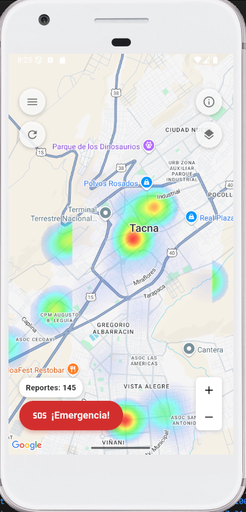
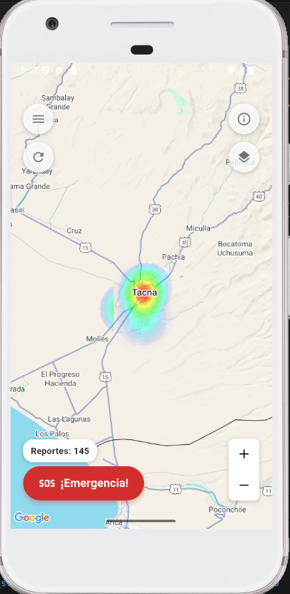
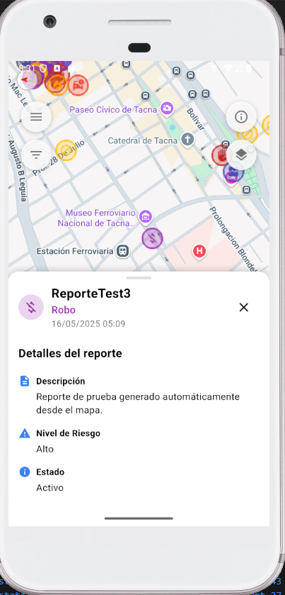
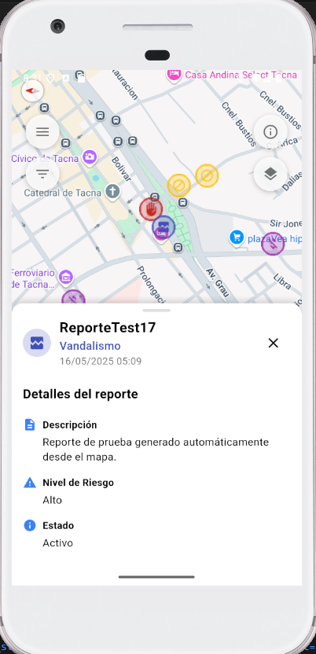
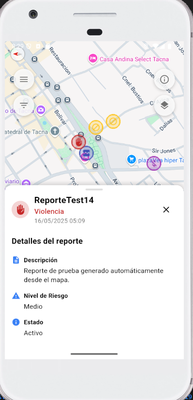

# SM2_EXAMEN_PRACTICO

# Credenciales de prueba (para evitar registarse)
correo: admin@gmail.com
password: admin123

# Pasos para la ejecucion
1. Flutter pub get (se debe tener instalado flutter SDK y un emulador de android)
2. Debug main.dart 

# Descripcion

Alerta Tacna" es una aplicación móvil diseñada para mejorar la seguridad y la percepción de esta entre los ciudadanos y turistas de Tacna. Utilizará inteligencia artificial y reportes colaborativos de la comunidad para identificar y visualizar en tiempo real zonas de alto riesgo mediante un mapa de calor. La aplicación ofrecerá cálculo de rutas seguras, notificaciones de proximidad a zonas peligrosas y un botón de emergencia. Su objetivo es centralizar la información de seguridad, fomentar la prevención y empoderar a los usuarios para que tomen decisiones informadas sobre su movilidad, contribuyendo a un entorno urbano más seguro.

# Funcionalidades del proyecto

# Historia 1

Como usuario, quiero poder visualizar un mapa interactivo de Tacna para poder ubicarme geolocalmente. Esta funcionalidad me permitirá tener una mejor orientación en la ciudad y me ayudará a moverme de manera más eficiente, ya que podré identificar las calles principales y los puntos de interés cercanos, como servicios y edificios relevantes. El mapa debe ser fácil de interactuar, con opciones de acercar y alejar para una vista más detallada de la ciudad.     

# Historia 2

Como usuario, quiero tocar una zona del mapa con datos de riesgo para ver detalles como el tipo de peligro, el nivel de riesgo y descripcion, de forma que pueda tomar decisiones informadas y evitar áreas peligrosas.  

